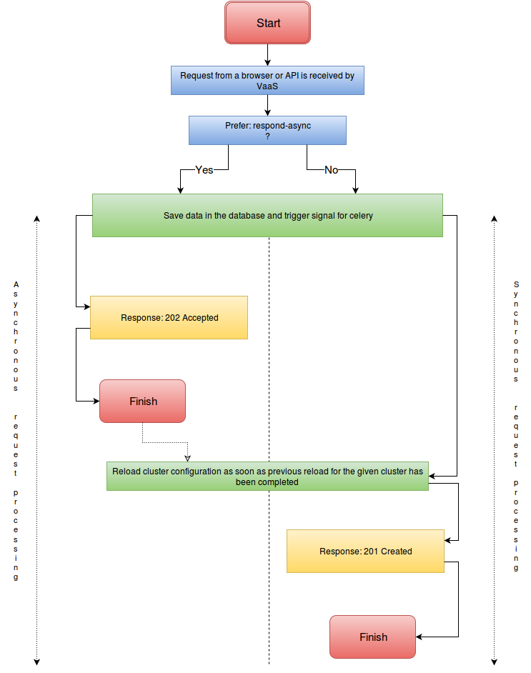

VaaS request flow
=================
VaaS uses Celery to queue requests. This is because reloading a Varnish cluster can take a long time, sometimes 30 seconds or more, and a reload has to complete before a new one is triggered. If multiple requests are received by VaaS while the cluser is reloading, each request’s data gets saved in the database and a new task is added to the queue. Once each cluster reload is finished, another reload is triggered if new tasks have been received in the meantime. Each task has a timestamp. Each cluster defined in VaaS is tagged with the timestamp of the newest task that has been successfuly processed (see *Cluster => Logical Cluster => Reload Timestamp* in VaaS). Since the data related to each task is saved in the database, only the newest task needs to trigger a cluster reload. The reload is only triggered if there are tasks in the queue with timestamp newer than the one associated with the given cluster. If a cluster reload fails for some reason, the timestamp of the erroneous task and error message is also saved for reference (see *Cluster => Logical Cluster => Error Timestamp / Last error* info in VaaS).

### Synchronous request processing
By default, VaaS processes requests synchronously. In practice it means that if you make a request using API to add a new backend to a director in a cluster, VaaS will return a 201 ('Created') HTTP status code only after the entire cluster has been successfuly reloaded. Take a look at the diagram below for details.

### Asynchronous request processing
If your request contains 'Prefer' header and it is set to 'respond-async', VaaS will process your request asynchronously. This means that if you make a request using API to add a new backend to a director in a cluster, VaaS will return a 202 ('Accepted') HTTP status code as soon as the data is saved in the database. The task will be queued for processing and will be processed either immediately or, if the cluster is currently being reloaded, as soon as the running reload is finished. Take a look at the diagram below for details.

### Request processing diagram
This diagram pictures a request flow in VaaS.

